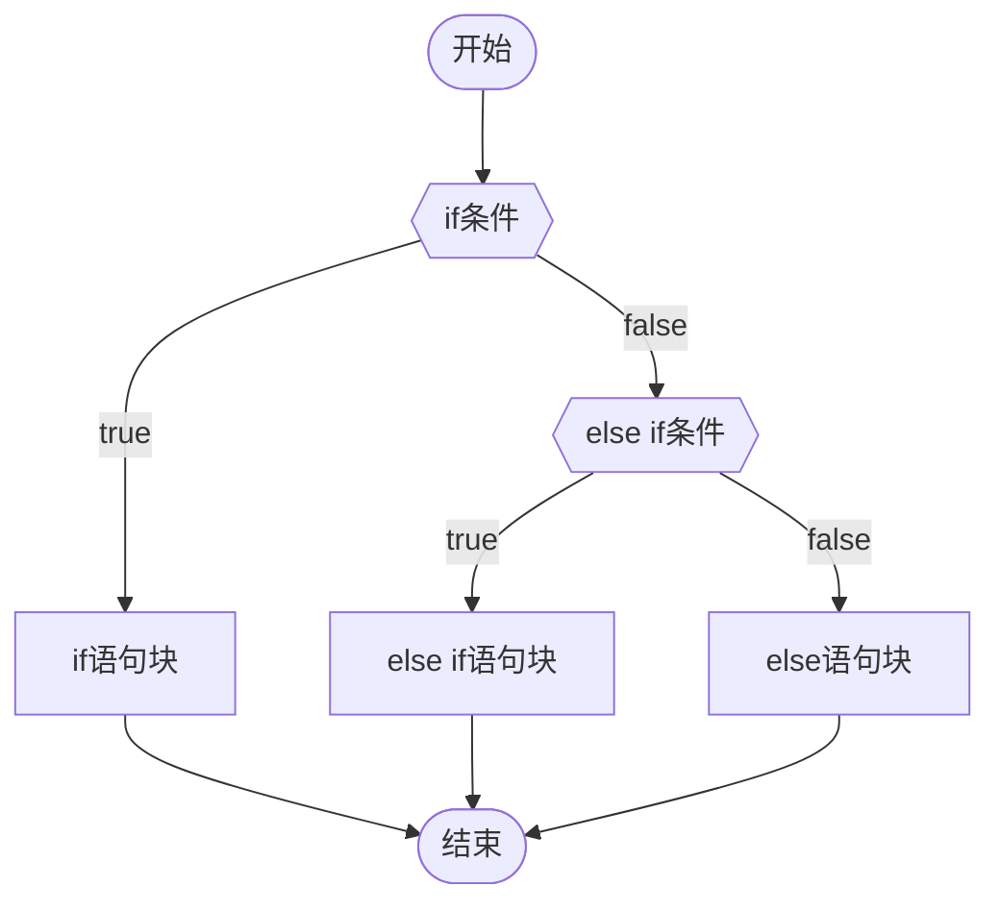
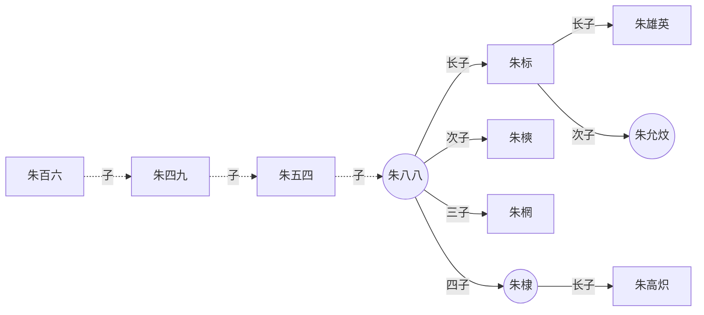
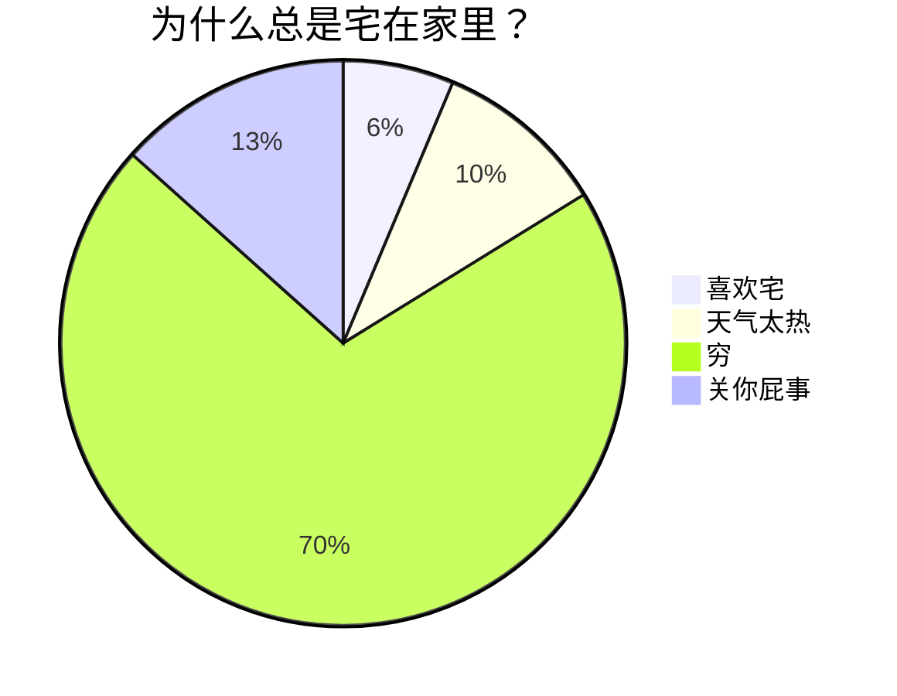
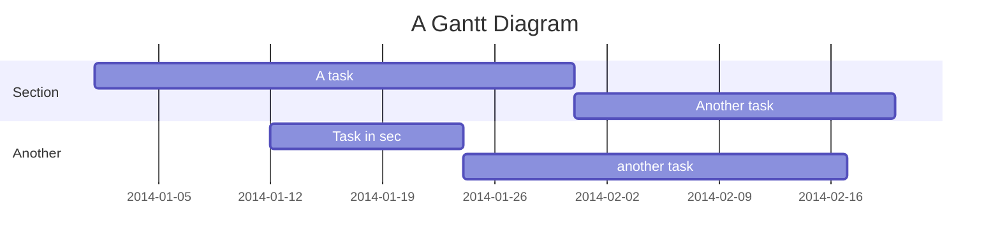
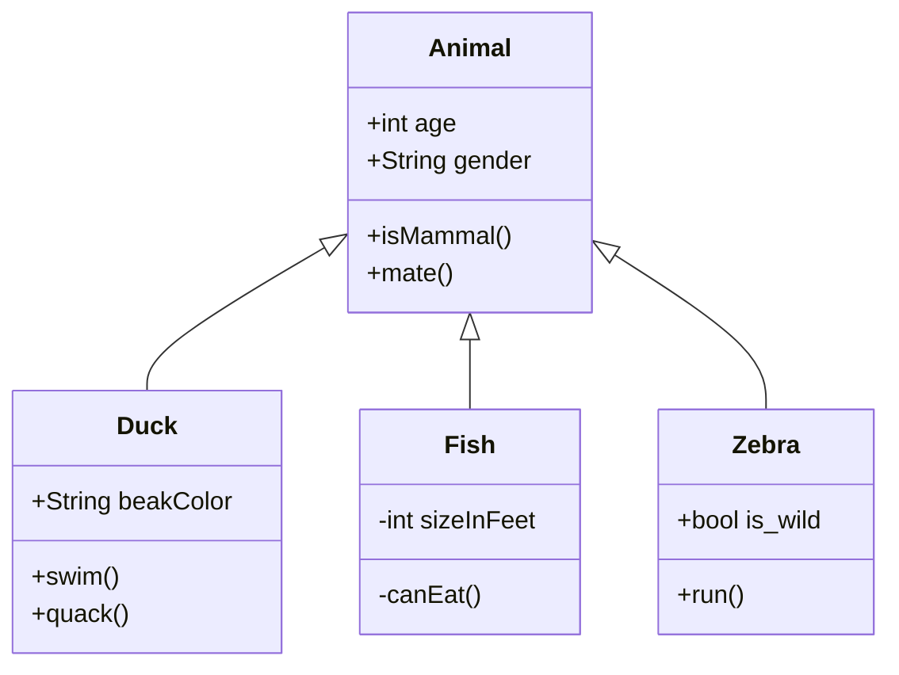

## 1. Mermaid

-   一些 **MD编辑器** 和 **笔记软件** 支持通过 **[Mermaid](https://link.zhihu.com/?target=https%3A//mermaid-js.github.io/)** 及其所提供的 [编译器](https://link.zhihu.com/?target=https%3A//mermaid-js.github.io/mermaid-live-editor) 来为用户提供图表的绘制功能  
    
-   这里只提供一些演示的图表，具体教程可戳下方  
    
-   [[MOC Mermiad 教程 Obsidian版| Mermiad 超级教程 Obsidian版]]

### 20.4. 流程图

  

**源码1：**

````text

````

**渲染1：**

```text
graph TB
    %% s=start  e=end  f=fork  n=normal

    s([开始])-->f1{{if条件}};

    %% 分支点1
    f1--true-->n1[if语句块]-->e([结束]);
    f1--false-->f2{{else if条件}};

    %% 分支点2 
    f2--true-->n2[else if语句块]-->e;
    f2--false-->n3[else语句块]-->e;
```

  

**源码2：**

````text

````

**渲染2：**

```text
graph LR
    %% s=start  e=end  f= fork n=normal 

    %% 虚线
    s[朱百六]-.->|子|n1[朱四九]-.->|子|n2[朱五四]-.->|子|f1_帝((朱八八))

    %% 分支点 朱八八
    f1_帝-->|长子|f2[朱标]
    f1_帝-->|次子|n3[朱樉]
    f1_帝-->|三子|n4[朱棢]
    f1_帝-->|四子|n5_帝((朱棣))

    %% 分支点 朱标
    f2-->|长子|e1[朱雄英]
    f2-->|次子|e2_帝((朱允炆))

    n5_帝-->|长子|e3[朱高炽]
```

  

### 20.5. 饼图

  

**源码：**

````text

````

**渲染：**

```text
pie
    title 为什么总是宅在家里？
    "喜欢宅" : 45
    "天气太热" : 70
    "穷" : 500
    "关你屁事" : 95
```

  

### 20.6. 序列图 (时序图)

  

**源码：**

````text
```mermaid
sequenceDiagram
    %% 自动编号
    autonumber
    %% 定义参与者并取别名，aliases：别名
        participant A as Aly
        participant B as Bob
        participant C as CofCai
        %% 便签说明
        Note left of A: 只复习了一部分
        Note right of B: 没复习
        Note over A,B: are contacting

        A->>B: 明天是要考试吗？
        B-->>A: 好像是的！

        %% 显示并行发生的动作，parallel：平行
        %% par [action1]
        rect rgb(0, 25, 155)
            par askA
                C -->> A:你复习好了吗？
            and askB
                C -->> B:你复习好了吗？
            and self
                C ->>C:我还没准备复习......
            end
        end

        %% 背景高亮，提供一个有颜色的背景矩形
        rect rgb(25, 55, 0)
            loop 自问/Every min
            %% <br/>可以换行
            C ->> C:我什么时候<br/>开始复习呢？
            end
        end

        %% 可选择路径
        rect rgb(153, 83, 60)
            alt is good
                A ->> C:复习了一点
            else is common
                B ->> C:我也是
            end
            %% 没有else时可以提供默认的opt
            opt Extra response
                C ->> C:你们怎么不回答我
            end
        endsequenceDiagram
    %% 自动编号
    autonumber
    %% 定义参与者并取别名，aliases：别名
        participant A as Aly
        participant B as Bob
        participant C as CofCai
        %% 便签说明
        Note left of A: 只复习了一部分
        Note right of B: 没复习
        Note over A,B: are contacting

        A->>B: 明天是要考试吗？
        B-->>A: 好像是的！

        %% 显示并行发生的动作，parallel：平行
        %% par [action1]
        rect rgb(0, 25, 155)
            par askA
                C -->> A:你复习好了吗？
            and askB
                C -->> B:你复习好了吗？
            and self
                C ->>C:我还没准备复习......
            end
        end

        %% 背景高亮，提供一个有颜色的背景矩形
        rect rgb(25, 55, 0)
            loop 自问/Every min
            %% <br/>可以换行
            C ->> C:我什么时候<br/>开始复习呢？
            end
        end

        %% 可选择路径
        rect rgb(153, 83, 60)
            alt is good
                A ->> C:复习了一点
            else is common
                B ->> C:我也是
            end
            %% 没有else时可以提供默认的opt
            opt Extra response
                C ->> C:你们怎么不回答我
            end
        end
```
````

**渲染：**

```text
sequenceDiagram
    %% 自动编号
    autonumber
    %% 定义参与者并取别名，aliases：别名
        participant A as Aly
        participant B as Bob
        participant C as CofCai
        %% 便签说明
        Note left of A: 只复习了一部分
        Note right of B: 没复习
        Note over A,B: are contacting

        A->>B: 明天是要考试吗？
        B-->>A: 好像是的！

        %% 显示并行发生的动作，parallel：平行
        %% par [action1]
        rect rgb(0, 25, 155)
            par askA
                C -->> A:你复习好了吗？
            and askB
                C -->> B:你复习好了吗？
            and self
                C ->>C:我还没准备复习......
            end
        end

        %% 背景高亮，提供一个有颜色的背景矩形
        rect rgb(25, 55, 0)
            loop 自问/Every min
            %% <br/>可以换行
            C ->> C:我什么时候<br/>开始复习呢？
            end
        end

        %% 可选择路径
        rect rgb(153, 83, 60)
            alt is good
                A ->> C:复习了一点
            else is common
                B ->> C:我也是
            end
            %% 没有else时可以提供默认的opt
            opt Extra response
                C ->> C:你们怎么不回答我
            end
        end
```

  

### 20.7. 甘特图

  

**源码：**

````text

````

**渲染：**

```text
gantt
    title A Gantt Diagram
    dateFormat  YYYY-MM-DD
    section Section
    A task           :a1, 2014-01-01, 30d
    Another task     :after a1  , 20d
    section Another
    Task in sec      :2014-01-12  , 12d
    another task      : 24d
```

### 20.8. 类图

  

**源码：**

````text

````

**渲染：**

```text
classDiagram
    Animal <|-- Duck
    Animal <|-- Fish
    Animal <|-- Zebra
    Animal : +int age
    Animal : +String gender
    Animal: +isMammal()
    Animal: +mate()
    class Duck{
      +String beakColor
      +swim()
      +quack()
    }
    class Fish{
      -int sizeInFeet
      -canEat()
    }
    class Zebra{
      +bool is_wild
      +run()
    }
```
