是的你不需要安装任何插件，就可以在Obsidian 画图，天然支撑了 Mermaid 语法；
当然你喜欢也可以使用其他 脑图插件；
基于本库的思想，我更简易“专业的事情交给专业软件”让OB引用对应文件即可；
## 1. Mermaid 语法
### 1.1. 基本形状


### 1.2. 连线样式
-   实线箭头：分为无文本箭头和有文本箭头，有文本箭头有2种书写格式
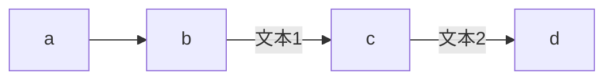
-   粗实线箭头：分为无文本箭头和有文本箭头
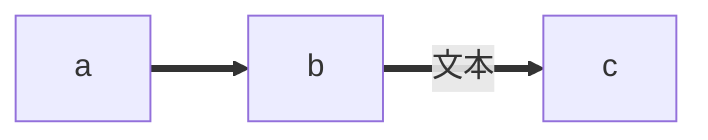
-   虚线箭头：分为无文本箭头和有文本箭头
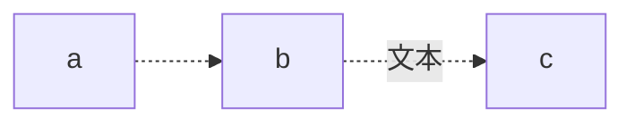
-   无箭头线：即以上三种连线去掉箭头后的形式
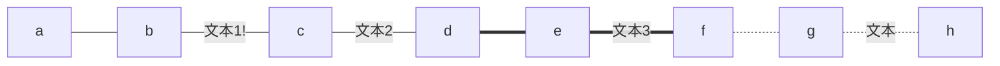

- 其他连线：需要将`graph`关键字改为`flowchart`，除了新增加的连线形式外，上面三种线的渲染效果也会不同
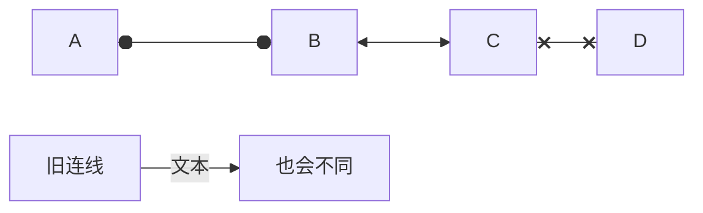

### 1.3. mermaid 纵向

> [!multi-column]
>
>> [!note]+ 普通流程（带流程提示）
>>
>>```mermaid
>>graph TD
>>A[Christmas] -->|Get money| B(Go shopping)
>>B --> C{Let me think}
>>C -->|One| D[Laptop]
>>C -->|Two| E[iPhone]
>>C -->|Three| F[fa:fa-car Car]
>>```
>
>>[!warning]+ 带判断
>>
>>```mermaid
>>flowchart TB
>>c1-->a2
>>subgraph one
>>a1-->a2
>>end
>>subgraph two
>>b1-->b2
>>end
>>subgraph three
>>c1-->c2
>>end
>>one --> two
>>three --> two
>>two --> c2
>>```
>


### 1.4. mermaid 横向（LR）
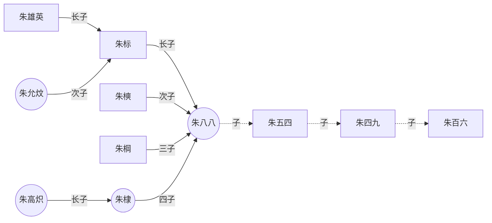

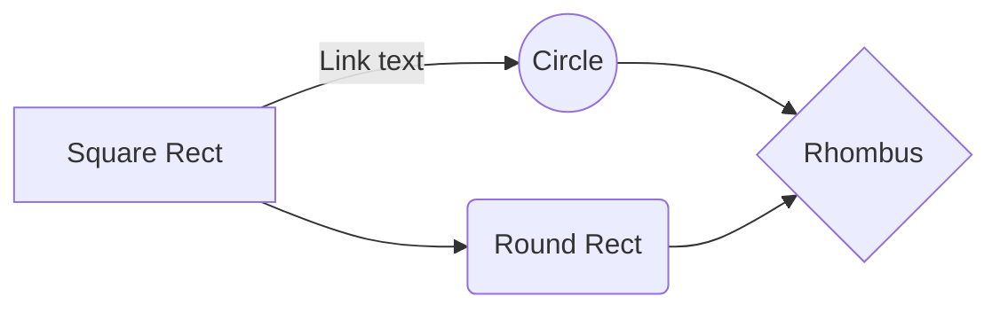

### 1.5. mermaid timeline
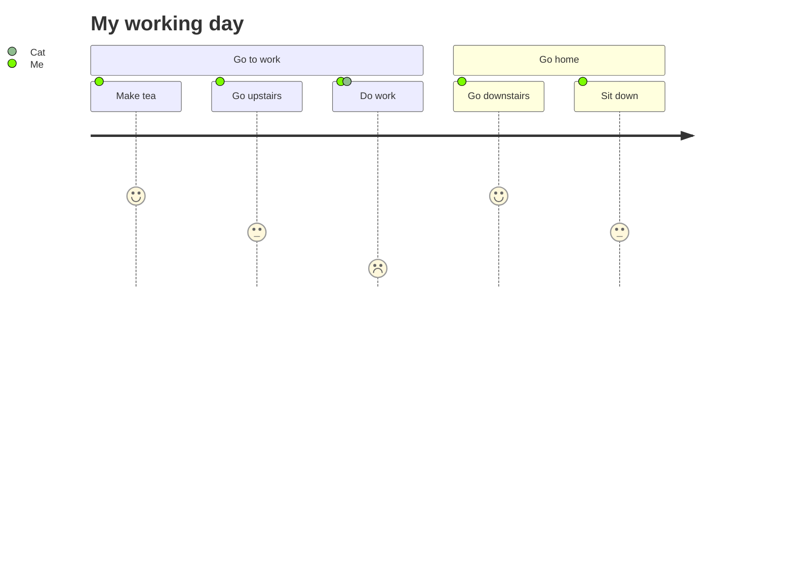


### 1.6. mermaid 流程图
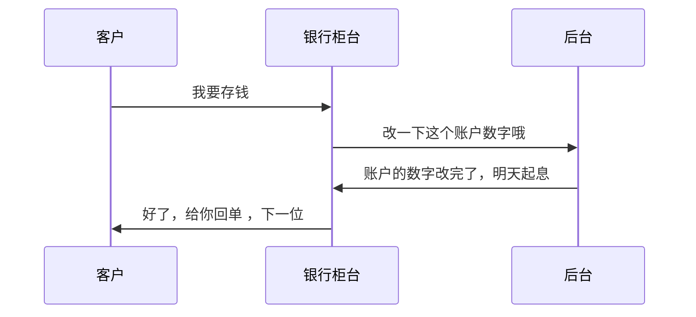

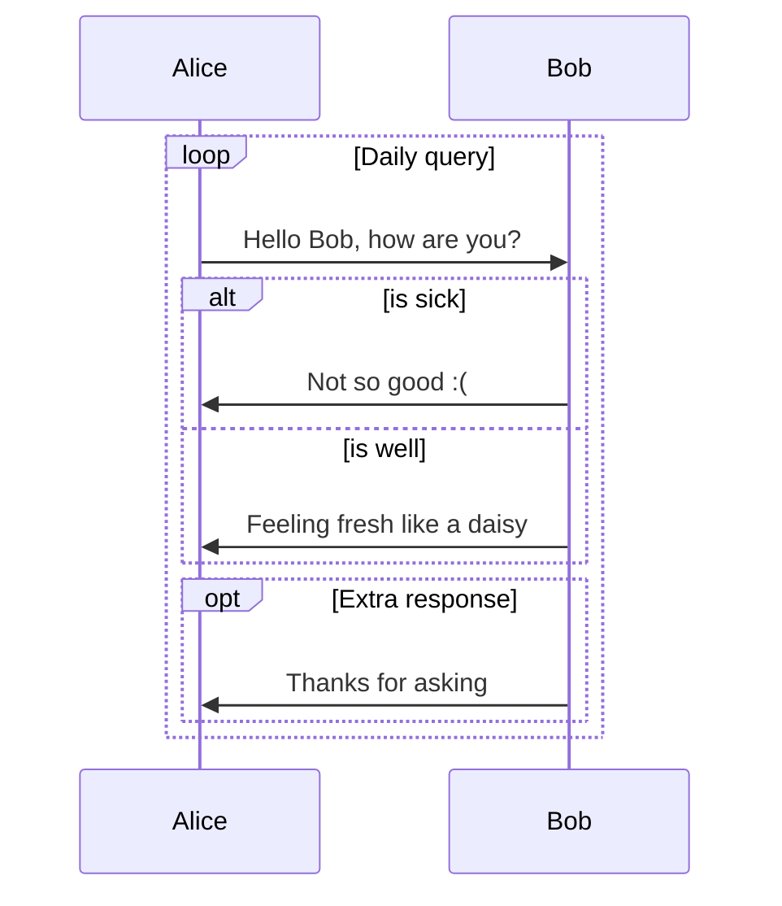

### 1.7. Grant 

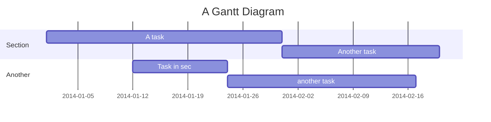

## 2. Maths 语法

### 2.1. Maths 语法

```math
||{"id":1275420307273}||
sinAcosB=1/2sin(A+B)+1/2sin(A-B)
```
```math
||{"id":465592853703}||
E=mc^2

```

```math
||{"id":667498649469}||
x^{y^z}=(1+{\rm e}^x)^{-2xy^w}
```
```math
||{"id":823966955848}||
f(x,y,z) = 3y^2z \left( 3+\frac{7x+5}{1+y^2} \right)
```
```math
||{"id":680907191674}||
\left. \frac{{\rm d}u}{{\rm d}x} \right| _{x=0}
```
```math
||{"id":652879747070}||
-|\vec{a}||\vec{b}| \leq |\vec{a}||\vec{b}|\cos\theta \leq |\vec{a}||\vec{b}|
```
```math
||{"id":87403306428}||

f(x)=\cfrac{1}{\sqrt{2\pi}}e^{-\frac{(x-\mu)^2}{2\sigma^2}}
```

### 2.2. 

- abc 
	- sdjfldsjf
- sdfjlsdfj


### 2.3. 多行分列语法MCL Multi Column.css
### 2.4. [1. 多欄式Callouts](http://jdev.tw/blog/7080#top "Back to top")

> [!tip] Callouts類型  
> 1. 顯示標題列：> [!multi-column]  
> 2. 隱藏標題列：> [!blank-container]
> 
> [!tip] 使用方法  
> 1. 欄位間用一個 > 分隔  
> 2. 每個Callout區塊多增加一個 >  
> 3. 欄位數由2到N，只要螢幕寬度足夠，會自動分配欄寬  
> 4. **可使用Style Settings外掛設定**

#### 2.4.1. 兩欄

> [!multi-column]
>
>
>> [!note]+ 待辦事項
>>
>> your notes or lists here. using markdown formatting
>
>> [!warning|right-small]+ 進行中事項
>>
>> your notes or lists here. using markdown formatting

#### 2.4.2. 三欄

> [!multi-column]
>
>> [!note]+ 待辦事項
>>
>> your notes or lists here. using markdown formatting
>
>> [!warning]+ 進行中事項
>>
>> your notes or lists here. using markdown formatting
>
>> [!success]+ 已完成事項
>>
>> your notes or lists here. using markdown formatting

#### 2.4.3. 1.3.四欄

> [!multi-column]
>
>> [!note]+ 待辦事項
>>
>> your notes or lists here. using markdown formatting
>
>> [!warning]+ 進行中事項
>>
>> your notes or lists here. using markdown formatting
>
>> [!success]+ 已完成事項
>>
>> your notes or lists here. using markdown formatting
>
>> [!info]+ 說明
>>
>> your notes or lists here. using markdown formatting

#### 2.4.4. 指定Callouts大小與浮動位置

> [!error|right-small] 浮動到右側
>
> 小視窗，靠右

擴充Callouts的語法，在Callout類型後加上Pipe，再輸入下列設定：

> [!tip] 語法
> 
> [!Callout類型|left/right-small/medium/large] </br>
>[!blank-container|left/right-small/medium/large]

### 2.5. 多欄式列表

> [!tip] 使用說明  
> 1. YAML區加入`cssClasses: 多欄CSS`即會自動顯示成指定的欄數  
> 2. 多欄CSS有下列幾種：
> 
> > 1.  two-column-list: 垂直填充
> > 2.  three-column-list: 垂直填充
> > 3.  two-column-grid-list: 水平填充
> > 4.  three-column-grid-list: 水平填充

### 2.6. 
![[❓语法帮助 image 1.jpg|ccenter|300]]

### 2.7. 文字环绕图片
《Fundamentals of Computer Graphics 5th Edition》

Drawing on an impressive roster of experts in the field, Fundamentals of Computer Graphics, Fifth Edition offers an ideal resource for computer course curricula as well as a user-friendly personal or professional reference.
Focusing on geometric intuition, this book gives the necessary information for understanding how images get onto the screen by using the complementary appro...>)


searchType: task.done, task.notdone
searchTarget:
pie:
    title: Pie Chart
    label: '{{2/30*100}}%, {{4/30*100}}%, {{6/30*100}}%, {{8/30*100}}%, {{10/30*100}}%'
    data: 2, 4, 6, 8, 10
    dataColor: '#4daf4a,#377eb8,#ff7f00,#984ea3,#e41a1c'
    ratioInnerRadius: 0.0


## 3. task 类型
- [ ] sdjlfkjslkf
- [x] sdjlfkjslkf
- [!] sdjlfkjslkf
- [?] sdjlfkjslkf
- [>] sdjlfkjslkf ✅ 2022-04-15

## 4. 注脚
sdjflsdjfklsjlfd[^1]

[^1]:dsfsdfsdfsdfsdfjdsfljsf


