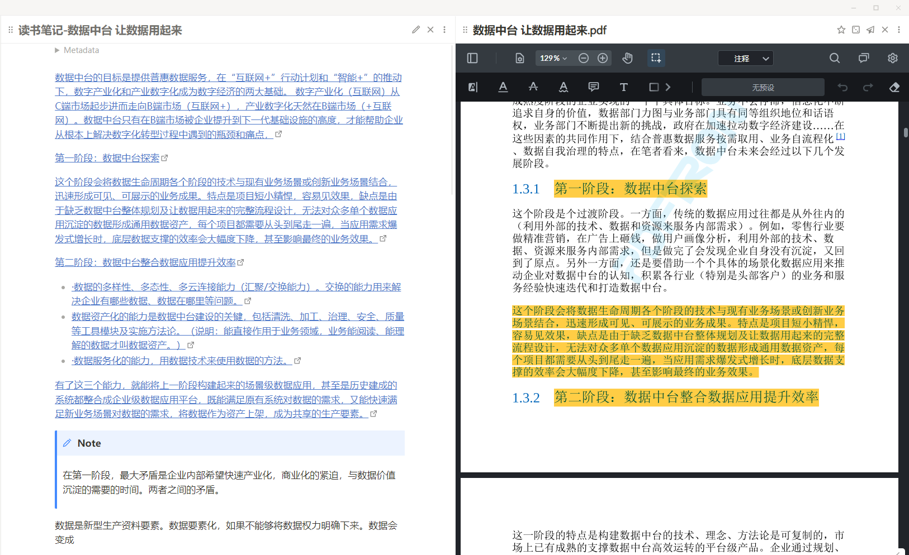

			

				<a tooltip="点我加入" style="color:orangered; margin-right: 1em;" href="http://qm.qq.com/cgi-bin/qm/qr?_wv=1027&amp;k=9SQlwaHi_PlWLoQq9Vu6BnGRmfGbmSPz&amp;authKey=knraTnnD8fKa17GO6Yz3z4GFem2Y2DmR9Ep5DiZE67CCDrYbNYer8AWkDIJJQmfW&amp;noverify=0&amp;group_code=825255377" class="astro-J75B3YUS">
					<svg xmlns="http://www.w3.org/2000/svg" aria-hidden="true" role="img" width="1em" height="1em" viewBox="0 0 1792 1792" data-icon="fa:qq" class="iconify w-5 h-5 astro-J75B3YUS iconify--fa"><path fill="currentColor" d="M270 806q-8-19-8-52q0-20 11-49t24-45q-1-22 7.5-53t22.5-43q0-139 92.5-288.5T637 66Q776 0 961 0q133 0 266 55q49 21 90 48t71 56t55 68t42 74t32.5 84.5T1543 475t22 98l1 5q55 83 55 150q0 14-9 40t-9 38q0 1 1.5 3.5t3.5 5t2 3.5q77 114 120.5 214.5T1774 1241q0 43-19.5 100t-55.5 57q-9 0-19.5-7.5t-19-17.5t-19-26t-16-26.5t-13.5-26t-9-17.5q-1-1-3-1l-5 4q-59 154-132 223q20 20 61.5 38.5t69 41.5t35.5 65q-2 4-4 16t-7 18q-64 97-302 97q-53 0-110.5-9t-98-20t-104.5-30q-15-5-23-7q-14-4-46-4.5t-40-1.5q-41 45-127.5 65T598 1792q-35 0-69-1.5t-93-9t-101-20.5t-74.5-40t-32.5-64q0-40 10-59.5t41-48.5q11-2 40.5-13t49.5-12q4 0 14-2q2-2 2-4l-2-3q-48-11-108-105.5T202 1253l-5-3q-4 0-12 20q-18 41-54.5 74.5T53 1382h-1q-4 0-6-4.5t-5-5.5q-23-54-23-100q0-275 252-466z"></path></svg>
					大佬专家都在，点此加群！
				</a>
		

## 1. 0.2.x版本计划（TBA）
- [ ] 计划：所有对插件的样式（CSS）调整，和插件间的兼容问题，都合并入主题（theme）文件中。这样大家可以按照自己喜好对插件进行升级。
- [ ] 计划：尽可能将一些样式设置，放入 style settings 中自定义能力更加图形化；
- [ ] 计划：探索更多的插件和精简冗余插件，保持库简洁性，防止启动插件过度膨胀；
- [ ] 计划：兼容 Obsidian v1.0.x（insider v0.16）；

## 2. 新版本预告
请点击 [更新日志（Changelog）](更新日志（Changelog）.md)

正在完成的一些细节，看板： https://github.com/users/juestchaos/projects/1

## 3. 目录结构
- Readme：版本预告、这个库引入的特性，包括插件、功能和样式；
- [更新日志（Changelog）](更新日志（Changelog）.md)：每个版本变更明细清楚的罗列；
- [插件说明](插件说明.md)：这个库历史加入和移除的插件；
- [插件大全](插件大全.md)：喜欢折腾的插件控们，你们的福音，表格有点大，页面确实有点卡顿；
- [常见的语法罗列](Obsidian-example/该库的常见样式罗列/常见的语法罗列.md)：想了解本库在常用模块上做了哪些修改，可以查看文件；
- [使用问题&FAQ](常见问题/使用问题&FAQ.md)：积累你可能在词库中遇到的样式和冲突的 FAQ；
- 完善 [Readme](Readme.md) 中对功能特性介绍更新；
- 增加了优化加速插件的说明：[优化Obsidian 启动速度](Obsidian-example/启动优化说明（基于模板插件）/优化Obsidian%20启动速度.md)；
- 开始着手在后面每期的更新中增加各种 Markdown，Obsidian 和本库的使用范例； 

## 4. 概述
诚然 Obsidian 是一款伟大的软件（I'm lovin it），但它还很年轻（市场占有率16%，相信这不是它的终点）。
目前可以说是一个“成以社区，败也社区”的阶段。保持满足日常使用（样式简洁、细节又有惊喜）的基础上，聚焦书写、积累知识。
成为了Obsidian 学习和使用过程中最耗费时间的事情，学习不是应该如此嘛😆？！

这便诞生这个即插即用库（Vault）的初衷。

## 5. 目标 

### 5.1. 原则一“专注写作和沉淀”
如果你像我一样完全不懂代码，那么请你忘记代码。
相信我，你完全可以专注在写作尚。不要浪费精力在插件和样式尚，甚至你可以都关掉它。

**请单纯的当作一个 All in One 的工具就好了**（所有的插件和样式都应是为了更好地书写和知识积累服务。）

### 5.2. 原则二“即插即用”
先后接触了Notion、Roam，也很期待 微软 的 Loop。

不得不说，这是个即快乐又痛苦的过程，Obsidian 最大的痛点是很多插件（Plugin）的使用学习，虽然教程可谓“丰富”，但对于大部分入门者来说，无疑阻碍了快速融入这个大家庭。（学习成本很高）

这就诞生了第二个原则“即插即用”，整个项目会尽可能调教好常用的插件设置，包括我自认为可用的模板范例和日常记录模式.

### 5.3. 原则三“稳定和低耦合”
整个过程中插件的稳定性，升级都会为整个笔记和知识库的使用体验带来不同的影响。

这就诞生了第三个原则“稳定和低耦合”
- 插件的稳定性很重要，该库中的插件版本，采用定期更新，而非跟随整体的社区插件版本；
- 尽可能减少插件的安装和使用，防止启动速度变慢；
- 防止过度依赖插件稳定或者更新，或者引入太多不必要的语法，导致markdown 本身的迁移性很差；

## 6. 详细
这里会依据“书写体验”、“文件的组织和管理”、“任务和知识沉淀”来描述这个库的使用方法

### 6.1. 概述
本库的常规特性，请参看此文件。插件状态等，请参考 [插件说明](插件说明.md)
### 6.2. 正文书写体验
#### 6.2.1. 正文文字样式
- 增强文本编辑时的体验
	- 通过【Editing toolbar】增加了文本编辑快捷菜单。
		- 功能：支持置顶、跟随光标、底部等多种常见模式，
		- 功能：支持自定义样式
- 快速切换标题的等级：【Lapel】
- 脚注增强，增强学术论文，引用脚注的体验。【Better footnote】插件

#### 6.2.2. 输入辅助

码字其实本身是一件体力活儿，自动拼写提示和完成，会大大节省和提高我们的输入效率。

1.【Various Complements】
- 利用自定义字典或者本文档的文本在当前文件中补充文本。 
	- 这里已经继承了一些，我认为比较好用的词典，在Knowledge\Obisdian-learning\var complete 目录下；
	- 其中包括英文和中文常用的词语；
	- 其中包括动物、财经、汽车、成语、地名、食物、IT、法律、历史名人、医药、诗词。当然你可以根据你的喜欢在这个插件中找到设置自行扩充；
- 利用自定义字典，可以达到一些快速输入复杂命令的目标，方便我们减少记忆 markdown 语法
	- 比如输入 “co-” 即会提示callouts 相关的所有自定义好的语法格式，不用在中文输入的时候考虑各切换。
	- 比如输入 "co-tri"、"co-mulit"，可以快速设置多列模式；
2.分词
- 【Word Splitting for Simplified Chinese in Edit Mode】：提供更好的对中文分词的支持；

#### 6.2.3. 目录增强

1、动态目录
这里使用了【Number Headlings】 
- 没有选用【Dynamic Table of Contents】【floating TOC】
- 优势：通过【Number Headlings】可以自动对标题进行编号，它近乎石全自动的；
- 缺点：因为利用【Number Headlings】实现了动态目录功能，所以会减少一层目录的使用，即你只能使用【H2】-【H6】

2、目录管理增强
【Quiet Outline】，支持多级目录导行，搜索定位，展开、收起。

#### 6.2.4. 图片和附件的管理
增强 Obsidian 对插入图片的文件管理和整理能力。

- 自动将复制到文档的图片，保存在与文档同目录的素材库中。基于【Local images】
- 让文章和插入的图片具有统一的名称，便于后续挪动时候管理。基于【consistent attachments and links】插件，
- 让文章和插入的图片具有统一的名称，便于后续挪动时候管理。在你放入图片的时候，自动被命名为和你的文档名一致，按照你插入的顺序自动编号。基于【attachment name formatting】
- 对文章中的图片可以进行旋转缩放，按照插入顺序浏览。基于【image toolkit】
	- 通过鼠标滚轮来放大或缩小图片。
	- 通过鼠标拖拽或键盘方向按键（上、下、左、右）来移动图片。
	- 通过点击底部工具栏的全屏图标来全屏查看图片。
	- 通过点击底部工具栏的左旋或右旋图标来旋转图片。
	- 通过点击底部工具栏的反色图标来实现图片的颜色反转。
	- 通过点击底部工具栏的拷贝图标来复制图片（不过目前仅能复制原图片，缩放或旋转后的图片样式暂无法复制）。

#### 6.2.5. Callouts 和 分栏样式
- 是的这个库没有集成 【Admonition】插件，反而使用了原生的 Callouts 语法。也符合降低耦合的逻辑。
- 改善 Obsidian 和 Markdown 流式语法展示的特点，方便需要并行展示多栏目任务。支持笔记的任意复数栏目样式，通过加载多行分列语法 MCL Multi Column.css，如果不需要可以在 “Obsidian -> 设置 -> 外观” 中关闭。
- 没有使用很多人推荐的【 multi-column-markdown 】是基于如下考虑：
	- 引入新语法过于复杂，不易记忆；
	- 语法完全依赖于插件，后期可能在插件无人维护后，整体迁移成本更高。

#### 6.2.6. 高亮样式
- 支持将日期和时间强化展示样式【 dynamic highlights 】
	- 17:00-19:00 参加生日会
	- 购物买 Gucci 包包给老婆 2021-05-27

#### 6.2.7. 表格

- 【Sorttable】可以赋予表格排序的功能；
- 【Table generator】可以图形化的插入表格；
- 【Table enhancer】可以图形化的，删除，增加，浮动方式，编辑单元格；

#### 6.2.8. 标签

- 标签能够依据书写逻辑，进行层级管理展示，基于【Tag Wrangler】插件
- 强化标签的展现，和样式控制，可以根据不同标签内容进行设置，基于【Colorful Tag】插件

#### 6.2.9. 头图

- 像 Notion 一样为你的每篇文章都可以自定义不同的头图 和 图标（ icon）。整个图片可以是来自网络的也可以是来自本地的，基于【 Banners 】插件。
	- 兼容：应对【Minimal 主题】和 【Banners】更新后导致的头图在不同浏览模式下高度异常的问题。

### 6.3. 强化流程图
【Excalidraw】：提供强大的快速草图能力；
【Diagrams-net】 ：旨在增强快速绘制流程图，和满足不习惯 Excalidraw 的同学；

### 6.4. 任务和信息的组织管理

- 【Task Progress Bar】：为任务列表、bullet list 添加进度条，统计每个任务下面的子任务；
- 【Reminder】为task 和 todo 增加时间提醒，尤其是 Window 平台用户，可以通过打开 notification 开关获得本地系统通知；
-  【Force note view mode】通过 yaml 区域 的设定，指定文件的阅读/编辑模式。
- 【DB Folder】提供类似 Notion 中database 的能力，但目前还不支持多视图模式；
- 【CardBoard】提供基于 task 和 tag 的自动生成看板能力；
- 【Meta Edit】提供 meta 信息的编辑能力
- 【MetaTable】为每个文档的前面 frontmatter 区域增加可视化的表格视图，优化你的浏览体验。
- 强化始终时间显示，基于【Dynamic Highlights】的配置
	
- 【Kanban】标准的看板，需要独立维护组织看板文件；

### 6.5. 文件的组织和管理

#### 6.5.1. 文件管理
- 展示最近访问过的文件，基于【Recent Files】
- 【Novel word count】管理文件夹和文件对应的文件数量
- 像浏览器一样前进后退，支持历史数字，或者直接跳转到某个浏览过的文档【Pane Relief】
- 文档路径显示和快速目录层级切换，通过【Quick Explorer】实现，可以类似 Windows 的 localbars 进行快速定位和切换目录层级，从而达到切换文档的目的。

#### 6.5.2. 文件历史版本管理
- 【Trash Explorer】：提供Obsidian 文件管理器中展示 自带回收站的能力；
- 如果需要对历史管理可以参考这里：[2.1. 如果你对 Obsidian 自带的文件历史对比功能不满意](常见问题/使用问题&FAQ.md#2.1.%20如果你对%20Obsidian%20自带的文件历史对比功能不满意)

### 6.6. All in One

#### 6.6.1. 读书笔记沉淀
通过 【BookNote】插件，你可以直接引入多个PDF、MOB的文件目录，做为附件的电子书管理，所有在电子书上做的记录都可以进入到对应文件中，相当于笔记，笔记也反向关联电子书，点击笔记可以回看书中的具体位置。

#### 6.6.2. 网页信息
- 【Web Browser】：让 Obsidian 可以访问网页；
- 【Custom Frames】可以将常用工具，不再以 iframe 方式插入页面，而是使用独立的窗口工具
#### 6.6.3. 图书和电影的收集

基于 JS 和 【Buttons】插件执行宏命令，现在你可以通过命令，快速收藏你喜欢的电影和图书从豆瓣到你的库（Vault）

【Rich Links】
- 修复了大陆网络下请求 ifarmely 频繁报错；
- 优化，增强了针对豆瓣的书籍、电影的收藏时的显示评分；

#### 6.6.4. 直接进行搜索
直接在 Obsidian 内完成对某个关键词的搜索，【Web Browser】

### 6.7. 样式和设置
#### 6.7.1. 主题
整体基于 Minimal 主题为原型；
原因：这个主题支持较为全面，且样式更简约，符合整个"保持纯粹的"的理念

【Style settings】：提供任意主题或者 Snippets，以特定格式生成图形化的设置；
【Minimal Theme Settings】Minimal 官方提供的设置样式；

#### 6.7.2. 闪亮的新东西

集成了网上一些不错的设计

1、feature：启动动画功能，现在你可以选择任意的图片，或者动图来个性化启动了。
2、feature：Dataview Cards，主要用于生成基于dataview查询的图片墙样式，你可以将你的书籍、电影都放到这里面，而且不需要单独的维护他。
3、feature：编辑代码块按钮调整，原版不是很好点击，所以修改了一个样式版
4、feature：增加callouts语法，段落自动缩进写法。以下表达都是可以的
    > [!note|indent]
    > [!note indent]
5、feature：增加callouts语法，支持三种对齐方式。语法如下：
    > [!note|left] 、> [!note|center] 、> [!note|right]
	语法格式如下，以下两种方式均可：
	> [!note|right]
       > [!note right]
6、feature：增加callouts语法，支持自定义百分比宽度，每5%一个区间。以下表达都是可以的
	> [!note|30%]
	> [!note 30%]
7、feature：增加callouts语法，新类型[bookinfo]，用于生成豆瓣读书信息的页面，当然也可以用在别的地方
8、feature：增加图片的位置属性，支持自定义图片的对齐方式。包含对齐，方式和环绕效果
9、feature：鉴于本库集成的 callout 样式过度，已经在 【Various Complements】基础上，设定了关键字，有需要同学也可以仿照编辑自己的；路径：Obsidian-learning > varcomplete > !dict；

辛苦不易，打赏随缘。也可以下次一定，或者一件三连

关注 pkmer.cn

