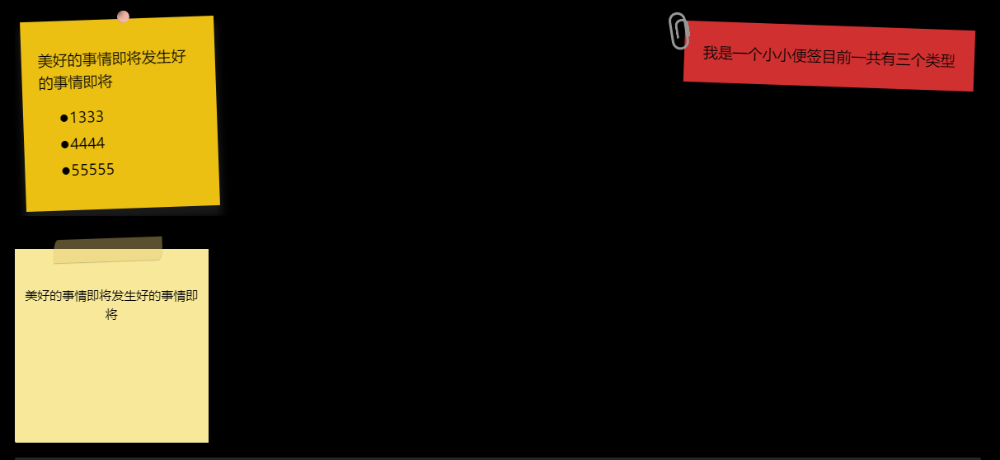

# 目录^TOC

- [[#目录^TOC|目录]]
	- [[#1. v0.2.13|1. v0.2.13]]
	- [[#2. v0.2.12|2. v0.2.12]]
	- [[#3. v0.2.11|3. v0.2.11]]
	- [[#4. v0.2.10|4. v0.2.10]]
	- [[#5. v0.2.9|5. v0.2.9]]
	- [[#6. v0.2.8|6. v0.2.8]]
	- [[#7. v0.2.7|7. v0.2.7]]
	- [[#8. v0.2.6|8. v0.2.6]]
	- [[#9. v0.2.5|9. v0.2.5]]
	- [[#10. v0.2.4|10. v0.2.4]]
	- [[#11. v0.2.3|11. v0.2.3]]
	- [[#12. v0.2.2|12. v0.2.2]]
	- [[#13. v0.2.1|13. v0.2.1]]
	- [[#14. v0.1.20|14. v0.1.20]]
	- [[#15. v0.1.19|15. v0.1.19]]
	- [[#16. v0.1.18|16. v0.1.18]]
	- [[#17. v0.1.17|17. v0.1.17]]
	- [[#18. v0.1.16|18. v0.1.16]]
	- [[#19. 0.1.15|19. 0.1.15]]
	- [[#20. v0.1.14|20. v0.1.14]]
	- [[#21. v0.1.13|21. v0.1.13]]
	- [[#22. v0.1.12|22. v0.1.12]]
	- [[#23. v0.1.11|23. v0.1.11]]
	- [[#24. v0.1.10|24. v0.1.10]]
	- [[#25. v0.1.9|25. v0.1.9]]
	- [[#26. v0.1.8|26. v0.1.8]]
	- [[#27. V0.1.7|27. V0.1.7]]
	- [[#28. v0.1.6|28. v0.1.6]]
	- [[#29. v0.1.5|29. v0.1.5]]
	- [[#30. v0.1.4|30. v0.1.4]]
	- [[#31. V0.1.2|31. V0.1.2]]
	- [[#32. v0.1.1|32. v0.1.1]]
	- [[#33. v0.1.0|33. v0.1.0]]

## 1. v0.2.13
1、📝概况
- 适配 
	- 适配版本：Obsidian v1.0.3；
	- 适配主题：Minimal 主题的 v6.1.11 版；
	- 主题配色适配：Notion，Things；
- 插件  
	-  插件数量：63个（18个插件默认未开启）

2、🔌插件
- 插件更新 
	- 【DB Folder】更新至 3.0.1；
	- 【Omnisearch】更新至 1.9.0；
	- 【Task】更新至 1.20.0；
	- 【Trash Explorer】更新至 1.1.10；
- ❌插件精简
	- 无
- ⚙️插件设置
	- 【Style Theme Settings】
		- 以后会随着每版本更新，这样大家可以看到我当前的配置；
		- 【Style Settings】 中大部分的关键样式的 minimal 主题设置做了汉化，自动根据你OB的语言设置进行切换；
		- 
3、🎨样式
- 新增
	- 【zettelkasten】
		- 路径：Obsidian-Plug-and-Play > obsidian > snippets > 【卡片视图】zettelkasten.css
		- 功能：提供一个卡片视图
		- 新增功能，支持通过在设置，【zettelkasten】样式的卡片集合控制宽度，从而控制每行可容纳的卡片数量；
	- 【minimal-正文标题】路径：style settings > minimal >
		- 增加正文标题对齐方式（左对齐，居中，右对齐）
		- 增加正文标题对齐方式下划线（长线，短线，无）
		- 增加正文标题左侧竖线样式开关
		- 可以设置相关正文线颜色
		
	- 【minimal-正文标题杂项】
		- 编辑状态使用H1-H6，来显示标题级别
		
		- 编辑模式下，点击标题，左侧平滑动画，并兼容【task progress bar】

- 样式优化
	- 无
- 🛠️样式修复
	- 正文标题侧滑动画 和 【task progress bar】 的冲突；

5、📕示例文件（路径：Obsidian-example）
- Obsidain-example 大幅度更新
	- 以使用视角，汇总整理了网上常用语法和对应的插件
	- 基本使用（ 路径：基本使用）
		- 正文标题
		- 段落
		- 列表
		- 表格
		- 图标
		- 提示框
		- 表格和嵌套
		- 目录
		- 引用
		- 代码块等
	- 包含一些进阶的CSS 和 dataview 用法（ 路径：进阶用法1~进阶用法3）
		- 包含多栏笔记生成
		- 脑图
		- 时间线
		- 乐谱
		- 公式等
		- 还包含 cssClasses 和 dataview 的使用
		- 包括推荐的 taskCalendar 的应用

6、🙁遗留问题
- 在页面搜索时，会触发整体布局页面的抖动，目前已经派出了主题的原因，正在排查是哪一个插件；

## 2. v0.2.12
1、📝概况
- 适配 
	- 适配版本：Obsidian v1.0.3；
	- 适配主题：Minimal 主题的 v6.1.11 版；
	- 主题配色适配：Notion，Things；
- 插件  
	-  插件数量：63个（18个插件默认未开启）

2、🔌插件
- 插件更新 
	- 【DB Folder】更新至 3.0.0；
	- 【Exclalidraw】更新至 1.8.4；
- ❌插件精简
	- 无
- ⚙️插件设置
	- 【Style Theme Settings】以后会随着每版本更新，这样大家可以看到我当前的配置；
3、🎨样式
- 新增
	- 【zettelkasten】
		- 路径：Obsidian-Plug-and-Play > obsidian > snippets > 【卡片视图】zettelkasten.css
		- 功能：提供一个视图
		- 【示例文件】路径：Obsidian-example > 进阶用法2-卡片知识
		- 
- 样式优化
	- 无
- 🛠️样式修复
	- 无

5、📕示例文件（路径：Obsidian-example）
- 【该库的看所有样式罗列】
	- 库的主要默认特性和默认样式罗列，你可以用他来测试你的改动是否会影响到一些常见配置
- 【基本使用】
	-  Markdown和Obsidian使用
		- 表格、callouts、环绕、表格
- 【进阶用法】
	- 多栏样式、脑图、timeline、乐谱、数学公示
- 【启动优化说明（基于模板插件）】
	- 查看此文件夹，你可以了解该库如何优化启动速度

6、🙁遗留问题
- 在页面搜索时，会触发整体布局页面的抖动，目前已经派出了主题的原因，正在排查是哪一个插件；

## 3. v0.2.11
1、📝概况
- 适配 
	- 适配版本：Obsidian v1.0.3；
	- 适配主题：Minimal 主题的 v6.1.8 版；
	- 主题配色适配：Notion，Things；
- 插件  
	-  插件数量：62个（15个插件默认未开启）

2、🔌插件
- 插件更新 
	- 【Recent Files】更新至 1.3.5；
	- 【CardBoard】更新至 0.6.7;
		- 支持自定义名称了
	- 【DB Folder】更新至 3.0.0；
	- 【Exclalidraw】更新至 1.8.2；
	- 【Quick Explorer】更新至0.2.7；
	- 【Quiet Outline】更新至 0.3.11；
	- 【Reminder】更新至0.2.7；
	- 【Rich Links】更新至 1.1.15；
		- 原有插件的作者长期不更新了，所以我在插件上做了一些修改；
		- 支持更好的支持douban 的图书和电影；
		- 【New】支持 B站的视频直接在 OB中播放

 - ✔️插件新增
	- 【Douban】1.7.8（默认不开启，有需要的同学）
		- 支持登录自己豆瓣账号后，同步豆瓣的收藏信息；
		- 支持按照收藏分类进行同步：电影，书籍，音乐，游戏，广播；
		- 支持按照收藏分类下，不同的进度状态同步：所有，想看，在看，看过；
		- 支持按照你配置模板进行数据装填，包括：笔记名称，笔记内容的字段；
		- 支持指定同步到目录位置；
		- 支持图片是否做为附件保存在本地；
- ❌插件精简
	- 无
- ⚙️插件设置
	- 【Style Theme Settings】以后会随着每版本更新，这样大家可以看到我当前的配置；

3、🎨样式
- 新增
	- 【Masonry.css】
		- 提供在拆分面板后，固定左侧panel，右侧所有Tab横向滑动的功能；如果你不需要也可关闭：
		- 路径：设置 > 外观 > CSS 代码片段 > Masonry

- 样式优化
	- 标签页（Tabs）：深色模式下的非活跃标签获得焦点时，标签页表标题的颜色：
	- 标签页（Tabs）：深色模式下的焦点标签的颜色
	- 标签页（Tabs）：与内容区域间边界线颜色，适配深浅色主题；
	- 修复样式对深色主题的适配
		- OB的设置（Settings）界面
		- OB的界面 titlebar 、tabheader；
	- 修复插件优化对深色主题的适配 
		- 【CardBoard】插件
		- 【Quick Explorer】插件
- 🛠️样式修复
	- 修复：文件管理器，文件类型符号(nav-file-tag）如PDF，XLS，显示位置异常，会显示在较长的文件名之上
	- 精简：精简代码，如果你需要，可以在主题文件【陈旧代码】中找到它们；

5、📕示例文件
- 修复：自【Dataview】升级5.3后，新代码导致的 Book List 和 Moive List 中选择评分的不生效的问题；
- 修复：修复模板文件，tp-book-callout.md、tp-movie，中grade 字段的声明
- 新增：【tp-book-callout-douban.md】模板，用于适配【Douban】插件的参数字段定义；
- 新增：Cardboard%20image%2020221203235639.png)

6、🙁遗留问题
- 在页面搜索时，会触发整体布局页面的抖动，目前已经派出了主题的原因，正在排查是哪一个插件；

## 4. v0.2.10
1、📝概况
- 适配 
	- 适配版本：Obsidian v1.0.3；
	- 适配主题：Minimal 主题的 v6.1.8 版；
	- 主题配色适配：Notion，Things；
- 插件  
	-  插件数量：62个（15个插件默认未开启）

2、🔌插件
- 插件更新 
	- 【Advanced Tables】更新至 0.18.0，状态默认未开启；
	- 【Attachment Name Formatting】更新至 1.6.4；
	- 【Card Board】更新至 0.6.6；
	- 【DB Folder】更新至 2.9.2；
	- 【Quick Add】更新至 0.7.0；
	- 【Quick Explorer】更新至0.2.6；
	- 【Quiet Outline】更新至 0.3.8；
	- 【Recent Files】更新至 1.3.4；
	- 【Task】更新至 1.19.0；
	- 【Web Browser】插件更名为【Surfing】
 - ✔️插件新增
	- 无
- ❌插件精简
	- 无
- ⚙️插件设置
	- 【Style Theme Settings】以后会随着每版本更新，这样大家可以看到我当前的配置；
3、🎨样式
- 新增
	- 【大纲】bullet threading 跟随原作者做了迭代更新；
		- 解决：指向某个目录（item）时候，子弹线和hover 背景冲突的问题；
- 样式优化
	- 优化：【Quick Explorer】在路径深度下的样式和指向时的缩放效果；
	- 优化：优化标签栏（Tabs）焦点和非焦点样式，更贴近Obsidian 原生，或者说更接近 Edge；
	- 优化：路径：theme settings > Minimal > Sidebars > Sidebar tab style；
	- 优化：顶部 frame 和 标签栏的背景色；
	- 优化：Ribbon 区域的自动隐藏 功能，持续优化了动画效果；路径：theme settings > Minimal > Ribbon；
	- 优化：【Quite Outline】插件
		- 适配深色主题下，搜索栏的底色
		- 适配深色主题下，大纲树hover下的文字颜色
		- 适配深色主题下，大纲树hover下的文字颜色

- 🛠️样式修复
	- 修复：Ribbon区域，在非全屏下鼠标指向时，无响应的状态；
	- 修复：OB设置（Settings）界面对深色主题不适配的问题；
	- 修复：【CardBoard】插件深色主题的适配；
	- 修复：【Quick Explorer】插件深色主题的适配

4、🙁遗留问题
- 在页面搜索时，会触发整体布局页面的抖动，目前已经派出了主题的原因，正在排查是哪一个插件；

## 5. v0.2.9
1、📝概况
- 适配 
	- 适配版本：Obsidian v1.0.3；
	- 适配主题：Minimal 主题的 v6.1.8 版；
	- 主题配色：Notion；
- 插件  
	-  插件数量：62个（15个插件默认未开启）
		- 是的，此版本大幅度调整了预启动的插件数量
		- 首先为了启动速度更快
		- 其次：其次：之前版本中，默认启动的插件存在内存泄漏，做为现在主力的笔记和工作软件，开启时间很长。此问题会导致界面响应变慢或引发不可知问题。
		- 我尝试定位这些问题，但能力有限，需要很长时间，甚至依赖原作者的修复。权宜（~~偷懒~~）之计就是依赖在用的时候开启它们。
		- 如果你的电脑配置够强悍，可以忽略这个问题。

2、🔌插件
- 插件更新 
	- 【Attachment Name Formatting】更新至 1.6.3；
		- 修复：原作者修复了统一文件重命名时，导致图片在文件中嵌入丢失的问题；
	- 【DB Folder】更新至 2.9.1；
	- 【Exclalidraw】更新至 1.8.0；
	- 【Omnisearch】更新至 1.8.1；
	- 【QuickAdd】更新至0.6.2；
	- 【Quick Explorer】更新至0.2.4；
	- 【Another Web Browser】插件替换【Web Browser】:功能一样， 只是为了后续可能稳定性更佳；
 - ✔️插件新增
	- 【SideKick】（默认：不开启）
		- 🎖️功能：
			- 基于文本针对现在库（vault）中文件名，tag等进行匹配，通过高亮方式给出串联的建议；很适合你在做自己的类似 wiki 或者笔记串联；
			- 支持中文，支持数字和日期的联想；
			- 该功能和 var comp 插件，和obsidian 自带的提示（suggest）近似，更适合对历史文件进行批量处理的场景下；
		- 🙁遗憾：
			- 不支持自定义开关不同类型的建议，比如数字、文字是否分别控制；
			- 与【Dynamic Highlights】插件的时钟配置冲突；
			- 不支持高亮提示样式的自定义；
- ❌插件精简
	- 【Convert url to Preview(iframe)】移除
		- 是的，我感觉她已经可以被【】
- ⚙️插件设置
	- 【Tasks Calendar】更新至 1.3.3
		- 【Tasks Calendar】是基于Dataview 的JS和样式配置；路径：Template > tasksCalendar；
		- 原作者支持了统计，你可以在嵌入代码的实例中找到；路径：Every Day > Dash Board；
		- 原作者支持了不同演示的切换；
	- 【Booknote】1.0后会因为样式异常，标题（file-content）和对应的文件类型标签（file-tag）样式错乱，保持和常用文件浏览器样式一致；
	- 【SideKick】优化了高亮提示的样式；
	- 【Kanban】设置为默认不启动；P.S.我自用的库中已经将其去掉了；

3、🎨样式
- 新增
	- 移植 Mado 11 的自动隐藏 ribbon 功能，鼠标进入到边缘时候展现；路径：theme settings > Minimal > Ribbon；
- 样式优化
	- 优化：Siderbar 区域 tab 按钮的 underline 样式优化，更见扁平化；路径：theme settings > Minimal > Sidebars > Sidebar tab style；
	- 优化：针对【TaskCalendar】进行了样式配置，放大了对应表格的字号；
	- 优化：移植 Mado  11 在设置界面（Settings）的配色；
- 🛠️样式修复
	- 修复：修复了之前焦点标签页（active Tab）右侧内圆角，和非焦点标签页边框冲突的问题；
	- 修复：在【Minimal Theme Settings】 中 打开【Text labels for primary navigation】开关后，导致导航栏布局有莫名留白；
	- 修复：设置菜单（settings）中，按钮（button）边框弧度；
	- 修复：正文引用内容的文字颜色和背景色设置；

4、🙁遗留问题
- 在页面搜索时，会触发整体布局页面的抖动，目前已经派出了主题的原因，正在排查是哪一个插件；
	
## 6. v0.2.8
1、📝概况
- 适配 
	- 适配 Obsidian v1.0.3；
	- 适配 Minimal 主题的 v6.1.8 版；
	- 配色：Notion；
- 插件  
	-  插件数量：62个（9个插件默认未开启）

2、🔌插件 
- 插件更新 
	- 【DB Folder】更新至 2.8.4；
	- 【Omnisearch】更新至 1.8.0；
- ✔️插件新增
	- 【SideKick】（默认：不开启）
		- 🎖️功能：
			- 基于文本针对现在库（vault）中文件名，tag等进行匹配，通过高亮方式给出串联的建议；很适合你在做自己的类似 wiki 或者笔记串联；
			- 支持中文，支持数字和日期的联想；
			- 该功能和 var comp 插件，和obsidian 自带的提示（suggest）近似，更适合对历史文件进行批量处理的场景下；
		- 🙁遗憾：
			- 不支持自定义开关不同类型的建议，比如数字、文字是否分别控制；
			- 与【Dynamic Highlights】插件的时钟配置冲突；
			- 不支持高亮提示样式的自定义；
- ❌插件精简
- ⚙️插件设置
	- 【Booknote】1.0后会因为样式异常，标题（file-content）和对应的文件类型标签（file-tag）样式错乱，导致渲染错乱问题。
	- 【SideKick】优化了高亮提示的样式；
	- 【Kanban】设置为默认不启动；P.S.我自用的库中已经将其去掉了；

3、🎨样式
- 样式优化
	- 优化：Siderbar 区域 tab 按钮的 underline 样式优化，更见扁平化
- 🛠️样式修复
	- 修复：修复了之前焦点标签页（active Tab）右侧内圆角，和非焦点标签页边框冲突的问题；
	- 修复：在【Minimal Theme Settings】 中 打开【Text labels for primary navigation】开关后，导致导航栏布局有莫名留白；
	- 修复：设置菜单（settings）中，按钮（button）边框弧度；
	- 修复：正文引用内容的文字颜色和背景色设置；

## 7. v0.2.7
1、📝概况
- 适配 
	- 适配 Obsidian v1.0.3；
	- 适配 Minimal 主题的 v6.1.8 版；
- 插件  
	-  插件数量：62个（7个插件默认未开启）
- 目录结构
	- Readme：版本预告、这个库引入的特性，包括插件、功能和样式；
	- [[更新日志（Changelog）]]：每个版本变更明细；
	- [插件说明](插件说明.md)：这个库历史加入和移除的插件；
	- [插件大全](插件大全.md)：喜欢折腾的插件控们，你们的福音，表格有点大，页面确实有点卡顿；
	- [[常见问题/使用问题&FAQ]]：积累你可能在词库中遇到的样式和冲突的 FAQ
- 完善 [[Readme]] 中对功能特性介绍更新 
- 开始着手在后面每期的更新中增加各种 Markdow，Obsidian 和本库的使用范例； 

2、🔌插件 
- 插件更新 
	- 【Trash Explorer】更新至 1.0.1；
	- 【Colorful Tag】更新至 1.2.2；
	- 【Excalidraw】更新至1.7.29；
- ✔️插件新增
	- 【CardBoard】（默认开启）
		- 🎖️功能：
			- 基于 Taks 和 Tag 自动聚合任务成看板；此方式不需要特别维护类似 【kanban】插件的特有文件，而是基于日常的编辑和使用，大大减少工作量的思路十分合适；
			- 支持自定义路径下的任务聚合；
			- 支持任务跳转到原始位置；
			- 支持在不同状态看板间的状态回退；
			- 支持直接在看板界面进行功能完成和删除的操作（不删除源页面的维护内容）；
			- 根据 【待办】、【今日】、【明日】、【未来】、【已完成】5种状态；
		- 🙁遗憾：
			- 对于无序列表和task 需要第一级就是任务模式，否则无法统计，作者已经接纳后续会支持；
			- 不支持切分面板模式，同时显示多个面板情况，会无法加载内容；
			- 不支持独立窗口模式；
			- 无法自定义模板分组
- ❌插件精简
	- 【convert-url-to-iframe】插件被 【Custom Frames】插件取代；
		- 功能：
			- 支持将常用 Web工具集成到 Obsidain，丰富Obsidian的功能；
			- 支持命令行，Ribbon 区域固定图标（图标可自定义）多方式调用；
- ⚙️插件设置
	- Obsidian-Tasks-Calendar（默认开启）
		- 功能：
			- 将 Task 按照月历视图展示，可以嵌入任意页面；
			- 支持跳转到对应的原始 Task 位置；
			- 将模式依赖的文件集成到 Template 文件夹（路径：Template > tasksCalendar）
		- Tips：这不是一个插件，而是集成在某个地方一段脚本代码，基于【Dataview】插件；
	-  【ABC Music Notation】插件，更改为默认不开启，提升启动速度；有对乐谱需要的同学可以自行开启；
## 8. v0.2.6

1、 📝概况
- 适配
	- 适配 Obsidian v1.0.3；
	- 适配 Minimal 主题的 v6.1.8 版；
- 插件  📝
	-  插件数量：62个（7个插件默认未开启）
- 开始着手在后面每期的更新中增加各种 markdow，obsidian 和本库的使用范例； 
2、🔌插件 
- 插件更新 
	- 【Task】更新至 1.8.1；
	- 【DB Folder】更新至 2.8.3；
		- 新特性：兼容 【Projects】 插件的功能还不完善，建议慎用；
- ✔️插件新增
	- 【Settings Search】（默认开启）
		- 功能：样式和主题文件，可通过特定格式生成对应的图形化操作界面；
		- 功能：支持插件设置页面以标签页（Tab）的方式出现，不需要每次进入设置页面，调整的所见即所得效果更好（命令面板：Stlye Settings:Show style settings view）
- ⚙️插件设置
	- 【Color Tag】增加了一些示例，希望对不了解这个插件的朋友有用；
	- 【Proxy Github】针对插件的JS进行一些微小调整，不影响功能的情况，注释 弹窗提示 和 console 的功能，这样不会有密密麻麻的弹窗了。（我在中文论坛里面也回答过类似的 pull ）  

3、🎨样式
- ✔️样式新增
	- 集成样式设置，现在你可以进入 style settings 的设置中；
		- 集成：搜素结果的文字和背景颜色设定。路径：theme settings > Minimal > Search；
		- 集成：标签页堆叠（Tab-stacked）：增加自上而下竖排模式。路径：theme settings > Minimal > Tab stacks（option：Top-vertical）；
		- 集成：标签（Tag）：增加内嵌模式和正文中行高的设定，防止过度标签堆叠时候的换行拥挤； 路径：路径：theme settings > Minimal > Tags > Tag line height/Tag line height in embed；

- 🛠️样式修复
	- **修复：【严重】代码块（embed ）编辑块按钮不易点击的问题；**
	- 修复：优化和修复 表格（Tables）在不同嵌套模式下，镶边行的样式（striped row ）；
	- 修复：标签页（Tabs） 圆角弧度样式；
	- 精简代码：如果你需要，可以在主题文件【陈旧代码】中找到它们；

## 9. v0.2.5
1、📝概况
- 适配 
	- 适配 Obsidian v1.0.3；
	- 适配 Minimal 主题的 v6.1.8 版；
- 插件  
	-  插件数量：61个（8个插件默认未开启）；
	-  【Omnisearch】 调整为手动启动
		- 索引时间不稳定，概率性 导致 Obsidian 会卡死在开启或者后续插件延迟加载阶段；有可能是本库同时开启了Booknote 或 加入了很多PDF文件，导致 Omnisearch 插件的新特性异常
	- 数据库：【DB folder】（暂时选用）
		- 【DB folder】数据处理功能上更接近 Notion 的 database
		- 【DB folder】日常操作图形化成都更高，尽管【Projects】提供了不同的 view 让人很欣喜；
2、🔌插件 
- 优化插件加载顺序：目前启动时间控制在3000-4000ms；
- 插件更新 
	- 【DB Folder】更新至 2.8.2；
	- 【Editing Toolbar】更新至 0.2.2；
	- 【Quick Explorer】更新至 0.2.3；
	- 【Quiet Outline】更新至 0.3.6；
	- 【Reminder】更新至 1.1.14；
	- 【Task】 更新至 1.18.0；
	- 【Templater】更新至 1.16.0；
	- 【Tag Wrangler】更新至 0.5.5；
- ❌插件精简
	- 【Search on Internet】插件被 【Web Browser】插件取代；
	- 【Remember File State】插件被【Force note view mode】插件取代；
	- 【增强编辑】插件被【Editing toolbar】插件取代；
	- 【File Explorer Note Count】插件被【Novel word count】插件取代；
	- 【Notion-like Table】插件被【DB Folder】插件取代；原作者已经不在进行维护了，暂时还没有新的接手同学。
	- 【Projects】插件被【DB Folder】插件取代；
- ✔️插件新增
	- 【Trash Explorer】（默认不开启）
		- 功能：支持在文件管理器部分，管理放入到 Obsidian Trash 的文件。看到国内外论坛都有人提到这个功能，所以集成进来；
	- 【Novel word count】（默认开启）
		- 功能：提供文件夹中显示包含笔记数量【可代替 File Exploer Note Count(测试中)】
		- 功能：提供文件中字数的统计
		- 功能：支持显示整个文件夹和文件的更新日期
		- 功能：支持统计格式的缩写
	- 【Colorful tag】（默认开启）
		- 功能：为标签添加前缀或后缀
		- 功能：支持独立设置每个标签更改标签文本大小或文本颜色
		- 功能：更改标签的边框圆角大小或标签的背景颜色
		- 功能：支持标签细节，意味着你可以实现标签和标签细节说明
		- 引入这个插件主要功能和 snippets 中的 【tag-pills.css】类似，不过想保持插件不臃肿，可以关闭此插件，自行手动去编辑 【tag-pills.css】文件；
3、🎨样式
- ✔️样式新增
	- 集成样式设置，现在你可以进入 style settings 的设置中；
		- 合并样式所有缩进线的设置整合；Indentation guides 中，包括缩进先水平位置调整，无序列表前缀；路径：theme settings > Minimal > Indentation guides
		- 引入了类似 blue topz 中，checkbox 的 tada 动画，你可以自由开关该动效；路径：theme settings > Minimal > list and tasks；
		- 回链（backlinks）在深浅主题下的适配和设置；路径：theme settings > Minimal > Links > Backlink embed style
		- 针对搜索结果的样式进行了修复
- 🛠️样式修复
	- 修复：无需列表前缀符号，在阅读视图下的错位；

## 10. v0.2.4
1、概况
- 适配
	- 适配 Obsidian v1.0.3
	- 适配 Minimal 主题的 v6.1.8 版；
- 插件
	-  插件数量：64个（10个插件默认未开启）；
2、插件
- 插件更新
	- 【Kanban】 更新至 1.5.1；
	- 【Omnisearch】更新至 1.7.10；
	- 【Buttons】更新至 0.4.19；
	- 【Excalidraw】更新至 1.7.27；
	- 【Obsidian42-BRAT】更新至 0.6.36；
	- 【Templater】更新至 1.14.4；
	- 【Tasks】更新至 1.17.0；
	- 【Template】更新至 1.15.3；
- 插件修复
	- 【Lapel】已修复之前版本中，无法通过点击进行大纲等级切换的 Bug【不常见】；
- 插件新增
	- 【Obsidian web browser】让Obsidian 可以在新建 tab 中浏览器网页；
		- 网页页签（tab）与新窗口产生移动（drag）新建（new）操作，会引发整个Obsidian 崩溃；
	- 【Projects】（0.21.2）
		-  界面：
			- 类似 Notion 中database 的视图；
		- 功能：
			- 支持快速索引对应文件夹下内容（可以代替 folder note 或者 dbfolder 插件）；
			- 支持在针对 tag、cssclass、time等meta信息的修改，完全取决于你使用了多少meta信息项；
			- 支持 table、Board、Calendar、Gallery 共4种视图模式；
		- 遗憾：
			- 图形化成都不高，交互方式还是需要使用命令好调出；
			- 目前支持针对 metadata 的处理，而非对所有数据，无法代替dataview
			- 不支持计算公式（formular）；
3、样式
- 新增
	- 集成样式设置，现在你可以进入 style settings 的设置中；
		- 针对无序列表或者有序列表，缩进线的水平布局调整，这可以有效缓解不同主题或者样式导致的错误；路径：theme settings > Minimal > 无序列表；
- 修复
	- 修复：无需列表前缀符号，在阅读视图下的错位；

## 11. v0.2.3
1、插件
- 插件数量：61个（9个插件默认未开启）；
- 插件更新
	- 【Task】 更新至 1.16.0
	- 【Various Complements】更新至 7.3.0；
	- 【Quick Latex for Obsidian】 更新至 2.5.1；
- 插件修复
2、样式
- 适配
	- 适配 Obsidian v1.0.3
	- 适配 Minimal 主题的 v6.1.8 版；
- 新增
	- 标签栏（tabs），优化焦点tab 和 非焦点tab 的样式；
	- 标签栏（tabs），堆叠模式（stacked）支持自上而下显示文字排版；
	- 集成样式设置，现在你可以进入 style settings 的设置中；
		- 编辑器-背景颜色（适配浅/暗色模式），路径：theme settings > Minimal > 编辑器背景色；
		- 无序列表前缀自定义，路径：theme settings > Minimal > 无序列表前缀（填写前缀符号，需要将符号放入''内才可生效）；
- 修复
	- 文件目录导航中，字号过大的问题【故障原因：因为 Obsidian 的 ctrl +滚轮，导致之前的适配工作有问题】
	- 设置界面，菜单字号过大的问题；【故障原因：同上】
	- 修复在不同外观基础色下，深浅色的正文编辑器背景色值修复；
3、遗留问题
- 【Lapel】插件目前仍然不可用，尝试解决中；

## 12. v0.2.2

1、插件
- 插件数量：61个（9个插件默认未开启）；
- 插件新增
	- 【Chronology】（默认：启动）；
		- 特性：支持显示当前月的日历（可代替【Calendar 插件】）；
		- 特性：支持选定日期后，展示对应编辑历史，根据编辑数量堆叠高度不同（可代替【Heat 类插件】）；
	- 【Calendar】（默认：未启动）；
		- 为了适用更广泛的用户诉求集成进入
- 插件更新
	- 【Ozan's Image in Editor】 更新至 2.1.5
	- 【Metatable】更新至 0.14.3
	- 【Various Complements】更新至 7.2.5
	- 【Omnisearch】更新至 1.7.5
	- 【ProxyGithub】更新至 1.15.0
	- 【Quick Latex for Obsidian】更新至 2.5.0
- 插件修复
	-  修复【style settings】对 minimal 主题的配置设置菜单（库 v0.1.20 引入）；
	- 【Lapel】插件，修复headings 下方添加边距后产生错位问题；
	- 【table-enhancer】 插件
		- 优化行编辑浮动按钮与表格的边距；
		- 行、列编辑浮动按钮的大小；
		- 优化当单元格获得焦点（is-editing）时，在部分情况下会产生模糊的问题；
2、样式
- 适配
	- 适配 Minimal 主题的 v6.1.2 版本；
- 新增
	- 为 callout 下的表格增添了和其父级一样的表头（title head）底色样式
- 修复
3、修复
- 主题代码精简和优化了原来的格式错乱
4、遗留问题
- 【Lapel】插件目前仍然不可用，尝试解决中；

## 13. v0.2.1

1、插件
- 插件数量：58个（6个插件默认未开启）；
- 插件更新
	- 【Buttons】更新至0.4.18
	- 【Excalidraw】更新至 1.7.25
	- 【Kanban】更新至 1.4.6
	- 【Minimal Theme Settings】更新至 6.0.5
	- 【Pane Relief】更新至 0.4.1
	- 【Quite Outline】更新至 0.3.3
	- 【Various Complements】更新至 7.2.4
- 插件修复
	- 【Various Complements】
		- 【库版本 v0.1.14 引入】修复插件不可用的问题；
		- 【库版本 v0.1.15 引入】修复自定义词典的配置错误，启动后的报错提示源自于此。
2、样式
- 修复
	- 修复：预览视图和编辑视图下，标题（Headings）下面的边框和；
	- 修复：预览视图和编辑视图下，callout 的标题背景色和背景边框；
	- 修复：编辑视图下，插入代码块embed的对齐和宽度问题；
	- 修复：预览视图下，checkbox 和无序列表样式冲突；
	- 修复：chekcbox 样式，更改为“矩形”；
	- 修复：预览视图和编辑视图下，无序列表和有序列表，缩进线（indent line）样式；
	- 修复：预览视图和编辑视图下，无序列表项目符号（marker）样式；
	- 修复：浅色和深色方案下，正文编辑器的背景底色；
3、修复
- 主题代码精简和优化了原来的格式错乱
4、遗留问题
- 【Lapel】插件目前仍然不可用，尝试解决中；

## 14. v0.1.20

1、适配 v1.0.0（Insider 0.16）
	之前引入的所有主题和CSS 的特性基本都已保留，如有报错可以反馈；
2、插件
	对插件进行粗略的兼容性测试，插件开启情况，请参见新的插件说明文档；
3、样式
- Minimal 主题同步更新到 6.x.x 版本；
- 保留了之前库中绝大多数新特性；
- 新特性
	- 增加文件目录树中，目录和文件指向（hover）时的滚动动画；
		- 这个特性和v01.16引入的，文件夹和文件名标题超长后自动截断，存在体验冲突，不喜欢同学可以二选一（注释掉对应的主题文件代码就好）；
	- tab 这个模式比之前的模板更适合多文件协同；
	- and so on；
- 样式优化
	- 优化主编辑窗口的背景色（#FFFFFE）；
	- 优化主编辑窗口，所有插入的图片默认增加黑色边框；
4、修复

P.S. 鉴于v1.0.0 发布不久，可以依据个人情况，继续使用本库的v0.1.19 版本

## 15. v0.1.19

1、插件
- 新插件引入
	- 使用【Editing Toolbar】代替 【cMenu plus】（v0.1.10引入），这两个插件都是 cumany 的作品，在此再次向各位隆重推荐。
		- 支持类似常见文本编辑工具置顶编辑工具栏；
		- 支持工具栏的子菜单模式，如heading下面可以包含（H1-H6）；
		- 支持丰富文字颜色、背景色（马克笔）表格；
		- 支持格式刷，和清除格式刷，所见即所得（WYSIWYG）的体验更好；
		- 能够和其他插件联动，添加命令（比如我增加了【Table Generator】的创建表格）
- 启动速度优化
	- 这不是一个当前版本引入的功能，而是利用 【Templater】插件实现的建议管控加载插件速度，毕竟大家可能都要加载十几甚至几十个插件，那么启动速度自然成了问题。
	- 文件位置，Template 文件夹下
		- 【FastStart-Plugins-ShortDelay】（优先加载的插件名单）
		- 【FastStart-Plugins-LongLongDelay】（次要加载的插件名单）
		- 【FastStart-Plugins-LongDelay】（最后加载的插件名单）
		- 【FastStart-GenerateListOfInstalledPlugins】
		- 【FastStart-StartupScript】（控制几个加载过程的延迟毫秒数）
	- 优点：加载名单里面只需要填写插件，对应电脑中的目录名称即可，很方便，无需去看代码或者找准代码位置；
	- 缺点：此方法强依赖 【Templater】插件，所以这个插件默认需要加载的，不能设置任何延迟逻辑
- 插件精简
	- 【cMenu plus】被精简；
- 插件更新
	- 【DataView】更新至 0.5.47；
	- 【Table Generator】更新至 1.3.1；
	- 【Table Enhancer】更新至 0.2.2；
	- 【Enhanced editing】更新至 0.5.5；
2、样式
- 样式优化
	- 针对table 进行标题栏的样式优化，增加下边框做区分；
	- 针对table 中指向时间，做了行浮起颜色的优化；
	- 针对 【Editing Toolbar】
		- 优化工具icon指向（hover）的样式
		- 插件在独立窗口模式下的子菜单高度问题
		- 插件设置菜单的指向样式
3、修复
- 修复0.1.18因为修复样式问题导致的主题代码冗余；
- 修复【metatable】【banner】以及独立窗口模式之间的高度兼容问题；

P.S. 鉴于v0.16 仍然未发布，本库依然会围绕 0.15 的版本进行，相信正式版释放后，还有大量适配工作需要进行

## 16. v0.1.18

1、插件
- 新插件引入
	- 使用 【Table Enhancer】、【Table Generator】插件，代替了原来的 table 相关插件，进而引入了新特性。
		- 直接在预览模式下进行单元格编辑不用模式切换；
		- 支持动态行列增删按钮；
		- 支持可视化的表格大小创建；
- 插件版本更新
	- 【Attachment Name Formatting】插件更新至 1.4.5
	- 【Buttons】插件更新至 0.4.17
	- 【Excalidraw】插件更新至 1.7.23
	- 【Kanban】插件更新至 1.4.5
	- 【Metatable】  插件更新至 0.14.2
	- 【Obsidian Math+】插件更新至 0.4.2
	- 【Pandoc Plugin】 插件更新至 0.4.1
	- 【Pane Relief】插件更新至 0.4.0
	- 【Quick Explore】 插件更新至 0.2.2
	- 【Task】插件更新至 1.15.1
	- 【Templater】插件更新至 1.14.3
- 插件精简
	- 【supercharged-links-obsidian】精简删除
2、样式优化
- 插件
	- 【task progress bar】的样式优化正式和插件自身更新解耦；
	- 【task progress bar】进度条长度优化；
	- 【pane-relief】优化历史计数器样式；
	- 【cMenu plus】优化符合主题的颜色指向hover样式；
- 常规样式
	- 优化文件目录树markdown文件之外的文件类型，显示文件类型前缀；
	- 优化设置菜单，左侧导行item 的左边框染色；
	- 优化文件目录树的展开收起箭头位置；
	- 优化文件目录树，文件获得焦点的效果；
	- 优化文件目录树，目录获得hover后的效果；
	- 左侧Ribbon 区，收起展开按钮位置；
	- 左侧Ribbon 区，设置工具按钮的位；
3、修复
- 样式修复
	- 修复之前 0.1.16 引入的 在 正文标题【headings】优化间距后，导致【Lapel】插件的快捷调整大纲按钮位置失效；
	- 修复之前 0.1.17 引入的 优化 窗体文件标题栏【titlebar】边框线，引入的界面错位；
	- 修复之前 0.1.17 引入的 文件标题栏【view header】边框线，引入的界面错位；

P.S. 鉴于v0.16 仍然未发布，本库依然会围绕 0.15 的版本进行，相信正式版释放后，还有大量适配工作需要进行

## 17. v0.1.17
1、New shinying things
原有的无序列表（ul）无论多少层级都在使用单纯 圆点 做为前缀（marker），多层级下辨识度不高。
现在替换如下
- 第一级（圆点）【circle inside】
	- 第二级（空心圆）【circle 】
		- 第三级（方块）【suqre inside】
			- 第四级（空心方框）【suqre】
				- 第五级（菱形）【diamond】
2、插件
	更新插件
		【Emoji Toolbar】 更新版本
		【Kanban】更新版本
		【Omnisearch】更新版本
		【Task Progress Bar】更新版本
		【Style Settings】更新版本
3、样式优化
	优化设置菜单中按钮指向后的颜色；
	优化设置菜单中内容设置项的分割线；
	工具图标的hover样式；
	文件目录中文件和文件夹的不同缩进样式优化；
	文件目录导航中文件夹支持导行超出后截断显示；
	文件名下方的边框线优化；
P.S. 鉴于v0.16 仍然未发布，本库依然会围绕 0.15 的版本进行，相信正式版释放后，还有大量适配工作需要进行

## 18. v0.1.16
- 插件精简
	- 删除 【folder note】 插件从专注笔记角度讲，这个插件的管理意义不如 使用dataview 生成的页面，自定义程度更高，有需要的同学可以参考库中的示例。
	- 删除【get info】插件，实际上有很多插件和obsidian 本身功能可以代替。
	- 删除 【Linter】插件；
	- 删除【markdown-table-editor】插件；
	- 删除【Supercharged links】插件；
- 插件新增
	- 【Reminder】为task 和 todo 增加时间提醒，尤其是 Window 平台用户，可以通过打开 notification 开关获得本地系统通知；
	- 【Custom Frames】可以将常用工具，不再以iframe 方式插入页面，而是使用独立的窗口工具
- 代码整合
	- metaedit 和banners 的相关改动代码，现在已经移入到了主题文件中，正式和插件更新解耦。
- 修复样式
	-  修复dataview Cards 视图下，图片和grid 错位问题
- 新样式：
	- 主要是为了适配PC，界面更加素雅，icon更大，圆角弧度进一步减小；以下这些并没有完全整合到 【theme setting】这样插件中，大家见谅
		- 部分整合 设置（settings）菜单 的样式控制
		- 部分整合 编辑视图和正文控制 的样式控制
		- 部分整合 titlebar 的样式控制
		- 部分整合 左侧导行栏Ribbon 的样式控制
		-  部分整合 导航栏 的样式控制
P.S. 鉴于v0.16 仍然未发布，本库依然会围绕 0.15 的版本进行，相信正式版释放后，还有大量适配工作需要进行

## 19. 0.1.15
- 样式优化
	-   优化目录树的文件夹样式
	-   优化目录树的展开收起箭头
	-   左侧导航栏，顶部导行样式调整
	-   为目录树添加点击文件后条目颜色后缀，和控制点击后的颜色

## 20. v0.1.14
- 代码整合
	- metaedit 和banners 的相关改动代码，现在已经移入到了主题文件中，正式和插件更新解耦。
- 修复样式
	-  修复dataview Cards 视图下，图片和grid 错位问题
- 新样式：
	- 给bookinfo 模式的表格增加指向（hover）的动画
	- dataview Cards 视图下，增加指向（hover）的动画
	- 优化tooltip的样式

## 21. v0.1.13
- 修复在没有 banner icon下metatable 的布局（页面的相对高度）异常
	- banner 插件在不添加 banner icon 的情况下，会和 metatable 插件的高度冲突。之前解决方案是的页面都添加了 banner icon。现在不需要了
## 22. v0.1.12
-   修复Demo 示例变化  
    因为 dataview插件升级到 5.3及以上版本后，导致的语法变化

## 23. v0.1.11

在0.1.10 的基础上修复了部分Demo 示例错误

## 24. v0.1.10
1.  更新 cmenu 到 cmenu plus 感谢 cuman 大大的优质代码

-   插件版本更新
-   插件支持彩色icon（标题和彩色文字，和背景色）
-   修复在某种情况，following模式和置顶（TOP）模式，下不同宽度的适配问题

2.  修复部分情况下，dataview table 在Cards 视图下的一场

P.S. 鉴于Obsidian V0.16 是一个交代版本的更新，所以目前所有的分支还都是基于V0.1.5。等到0.16 稳定后才会释放出来
## 25. v0.1.9

修复之前一些错误配置，和之前一些datajson 文件忘记同步的问题
## 26. v0.1.8
1. 修复
	- 修复插件【various-complements】中 data.json 中配置自定义词典的错误，之前历史版本中该配置指向了错误的相对路径
2. 新增插件 quick latex
	- 为了经常使用 latex 的同学
3. 精简插件
	- 删除markmind 插件，对于pdf文档来说，使用了booknote插件进行代替。之前的版本中已经集成【bookonte】插件
	
## 27. V0.1.7
1. 精简插件
	- 因为 v0.15.6 后支持了新窗口特性，所以 【hover editor】显得在多窗口和小屏幕下有些冗余了，故移除；
	- 偏小众诉求【obsidian-code-block-enhancer】
1. 更新插件
	- 【obsidian-collapse-all-plugin】更新插件目录结构
	- 更新插件 【obsidian-task-progress-bar】 至 1.5.1
2. 兼容性：无
3. 样式优化
	- 增加 checkbox 的复选框大小（--checkbox-size），减少和折叠块之间的误触
	- 【obsidian-task-progress-bar】
		- 增加 进度条的边框（border），优化任务进度的展示样式；
		- 优化进度条宽度（width），优化任务进度的展示样式；
5. 启动速度
	- 优化启动加载插件的顺序
6. 模板
	- 更新 tp-book-callout 
	- 更新 tp-movie-douban
	- 更新 moviefromdouban.js
		- 更新了，增加了关于国家和内容的抓取兼容性
7. 新特性
	- 暂无 TBA

## 28. v0.1.6
1.  目录结构修改

-   感谢 [@oldwinter](https://github.com/oldwinter) 的反馈，之前有一个目录命名的疏漏

2.  插件版本更新

-   更新插件 【obsidian-task-progress-bar】 至 1.5.0
-   更新插件 【various-complements】 至 7.0.6
-   更新插件 【tag-wrangler】 至 0.5.3
-   更新插件 【quick-explorer】 至 0.1.32
-   更新插件 【pane-relief】 至 0.2.1
-   更新插件 【recent-files-obsidian】 至 1.3.3
-   更新插件 【obsidian-tasks-plugin】 至 1.9.0
-   更新插件 【dataview】 至0.5.41
-   更新插件 【number-headings-obsidian】 至1.9.0
-   更新插件 【obsidian-quiet-outline】 至0.3.2
-   更新插件 【oz-image-plugin】 至 2.1.3

## 29. v0.1.5
修复：  
-因为更新15.0后，引入新特性，在新窗口下，【banners】插件的显示异常  
优化：  
-精简插件 【better-word-count】  
-精简插件 【cm-show-whitespace-obsidian】

## 30. v0.1.4
1.  Dataview 更新至5.3.8
-   修复：dataview升级后，dataviewjs 查询引发的按钮（buttonmaker）样式错乱  
    2.Lapel：
-   增加标题等级选择块的样式

3.  插件
	插件新增：
	-  【DB Folder】：建立文件夹中类似Notion的管理目录，不需要可删除，目前未和任何其他功能和示例联动
	- 【Diagrams-net】：旨在增强快速画图，和不习惯 Excalidraw 的同学；不需要可删除，目前未和任何其他功能和示例联动
	- 【Task Progress Bar】：为你任务列表、bullet list 添加进度条；目前效能和稳定性较差，持续观察。

4.  🎨样式
	-   增强：编辑视图下列表连接线颜色和位置
	-   增强：编辑代码块按钮调整

## 31. V0.1.2
闪亮的新东西：  
- 增加了纵向排版文字的callouts 能力

优化：
-   优化区块编辑按钮样

## 32. v0.1.1

🎨样式：
	修复:读书笔记实例中笔记摘抄的不显示图片问题

## 33. v0.1.0

v0.1.0Beta 试用版本